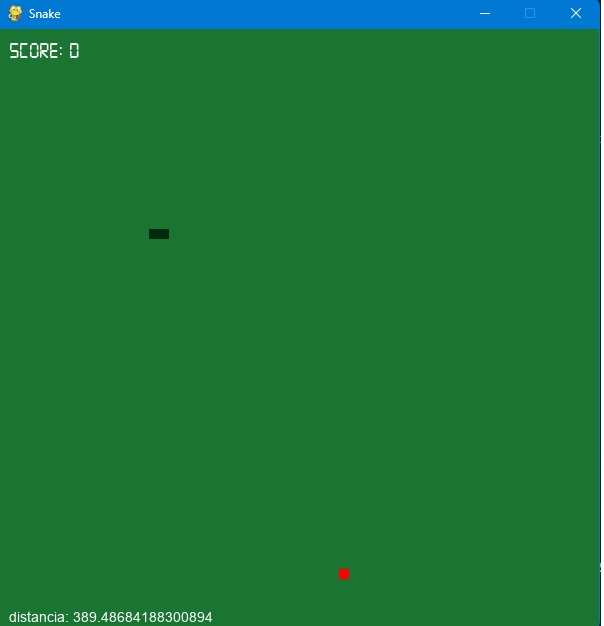

# Snake Pygame

Snake game created with PyCharm is a classic arcade-style game where the player controls a snake that moves around the screen, eating food and growing longer with each piece consumed. The goal is to avoid colliding with the walls or the snake's own body while collecting as much food as possible. The game features smooth controls, colorful graphics, and an intuitive interface that make it easy to play and enjoy. Created using the PyCharm IDE, this game is a great example of how Python can be used to create fun and engaging projects that showcase the power and versatility of this popular programming language.

